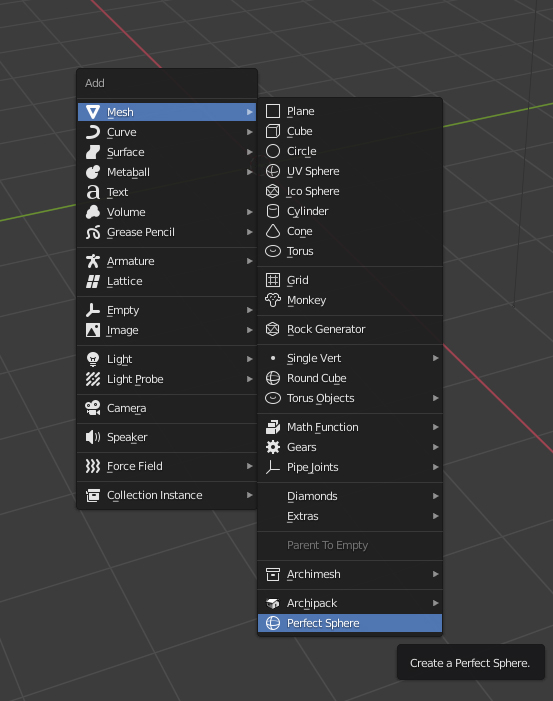

# Perfect Sphere
Simple Blender addon that adds cube, subdivides it and gives it cast modifier with factor of 1 to speed up your workflow.

Installation steps:

Download the file -> Open Blender -> Edit -> Preferences Add-ons -> Install -> Find file named "perfect_sphere.py" and press "Install Add-on"
To enable click on the "Add Mesh: Perfect Sphere" in the list of addons

 
